# Install MongoDB
* Download mongo db from - https://www.mongodb.com/try/download/community
	* Select appropriate `version`, `platform`, `package`
	* Prefer downloading `zip`
	* Click `Download` button
* Unzip if zip is downloaded
* Install if msi is downloaded
* Start mongo db database
```
location-to-mongo-db-bin>mongod.exe
```
* Start mongo console to execute queries
```
location-to-mongo-db-bin>mongo.exe
```

# Mongo GUI Clients
* [RoboMongo](https://robomongo.org/download)
* [NoSqlClient](https://github.com/nosqlclient/nosqlclient/releases)

# Database categories
* High level view
	* OLTP (RDBMS) - Real Time Storage
		* Oracle
		* SQL Server
		* MySQL
		* Postgre Sql
	* NoSql
		* MongoDB
		* Cassandra
		* HBase
		* Neo4J
		* Couchbase
		* Redis
		* Elastic Search\

* Specifics\

* Sql vs NoSql
	* Vertical scaling vs Horizontal scaling
			* Horizontal scaling means scaling by adding more machines to your pool of resources (also described as `scaling out`)
			* Vertical scaling means scaling by adding more power (e.g. CPU, RAM) to an existing machine (also described as `scaling up`)\
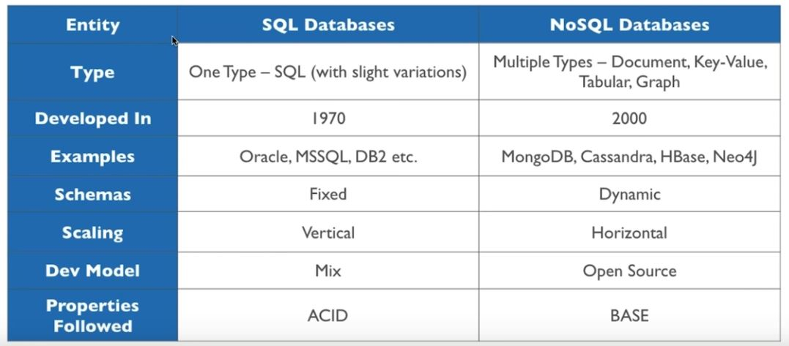
* Sql ACID properties\
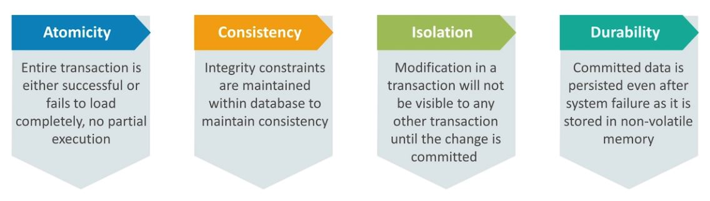
* NoSql flow\
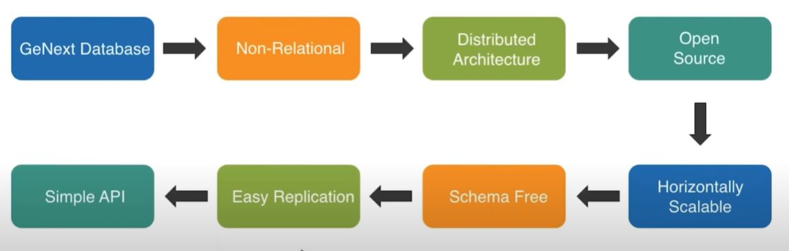
* NoSql `BASE` property\
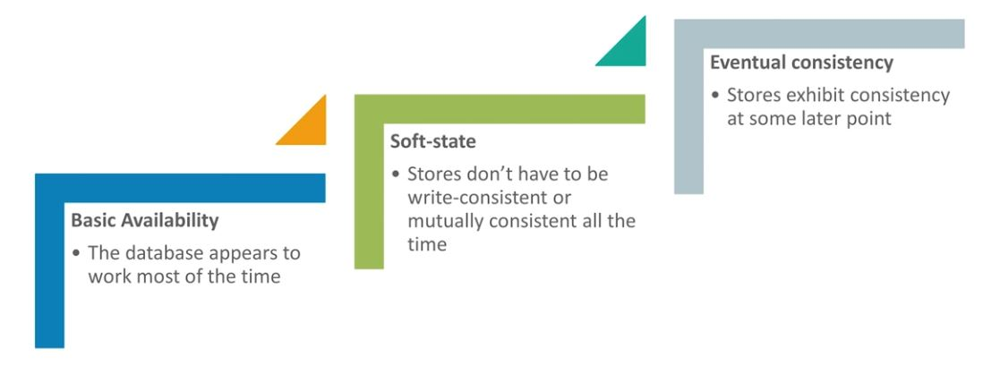
* Every NoSql works on `CAP` theory
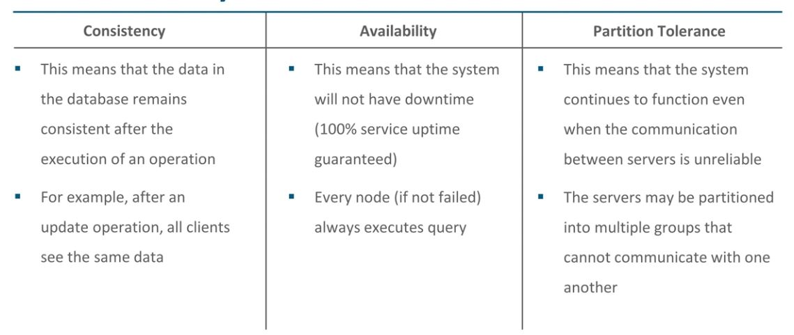
* CAP combinations\
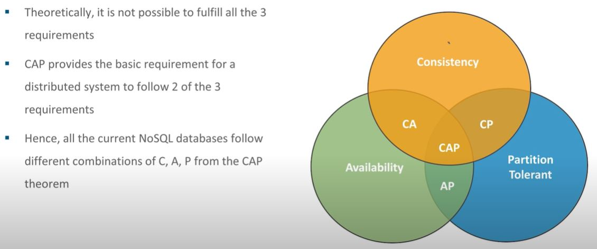
* CAP combinations with NoSql DBs\
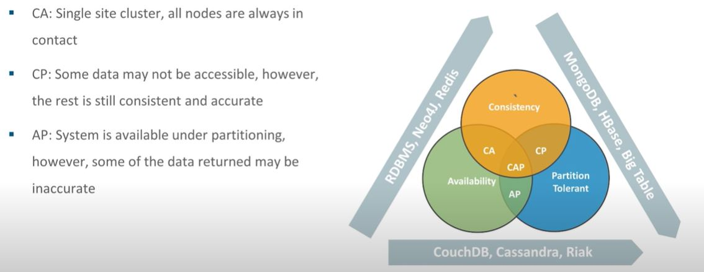

# Features of NoSql Database
* Supports high volume of transactions - tens of thousands to millions
* Provides extremely responsive experience
* No downtime. Always available
* Quickly adopts to changing requirements with frequent updates and new features
* Handles semi and unstructured data
* Database storage\
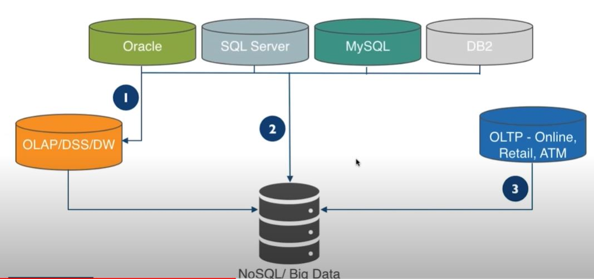

# Advantage of NoSql Database
* VVVV - Volume, Velocity, Variability, Veracity
* Volume
	* Amount of data
* Velocity
	* Data in motion
		* Streaming of data
		* Milli seconds to seconds to respond
* Variability
	* Data in many forms
		* Structured
		* Unstructured
		* Text
		* Key-Value
		* Graph
		* Documented
		* Columnar
* Veracity
	* Data in doubt
		* Uncertainity due to latency, ambiguity etc

# Nosql Notes
* Schema less
* Dynamic schema
* Most of NoSqls are open source
* Multiple categories
	* Document
	* Key-Value
	* Tabular
	* Graph\
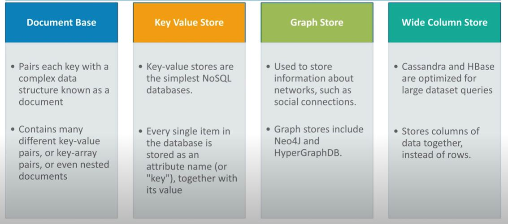
* Examples of categories
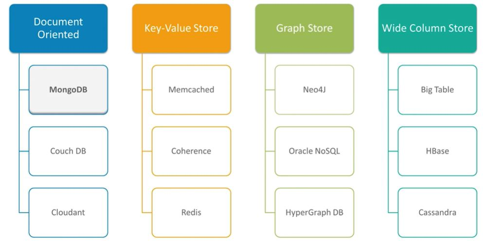
* Horizontal Scaling
* Supports distributed by default

# MongoDB Notes
* Open source document based database
* Works on concept of `collection` and `document`
* No concept of primary key and foreign key on tables
* High performance
* High availability
* Easy scalability
* Data stores in the form of `JSON`
* Features\
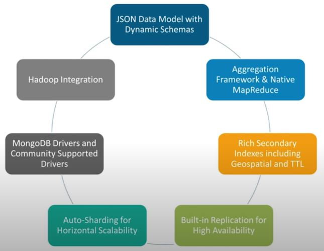
* Reasons to use mongo
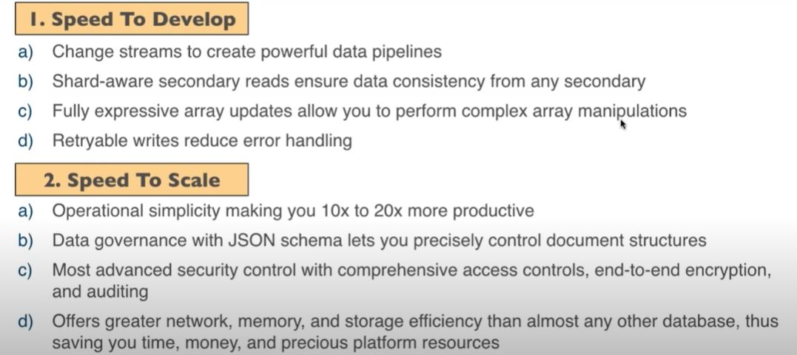
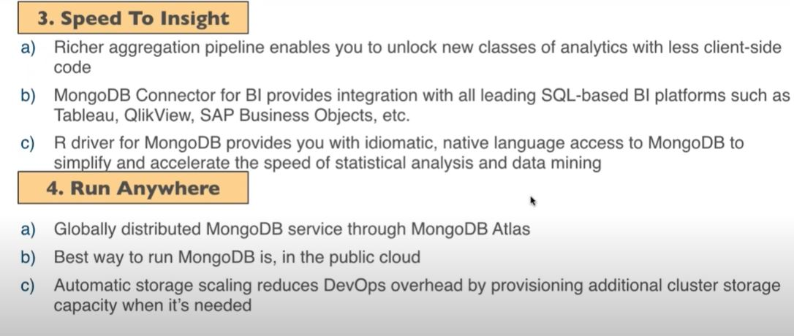

## Advantages
* Schema less document based database
* Supports dynamic queries on documents
* Does not require complex joins
* Easy to scale
* Enable faster access of data by using internal memory
* Mapping of application objects to database object is not needed
* Easy to tune for performance

## Tools Terminologies
* Mongo database `MongoD`
	* Physical container for collections
	* Each database get it's own files on file system
	* Single mongodb server can have multiple databases
	* handles data requests
	* manages data format
	* performs background management operations
* Collection
	* Group of similar/related documents within single database
	* Similar to `RDBMS table`
	* Do not enforce schema
	* Documents within collection can have different fields
* RDBMS terminology and MongoDB\
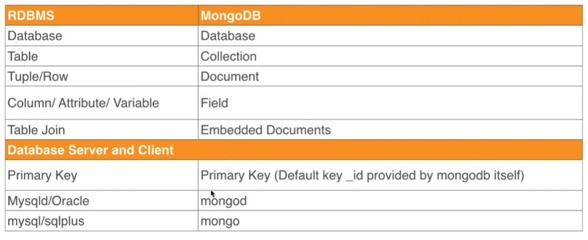
* Mongo Tools\
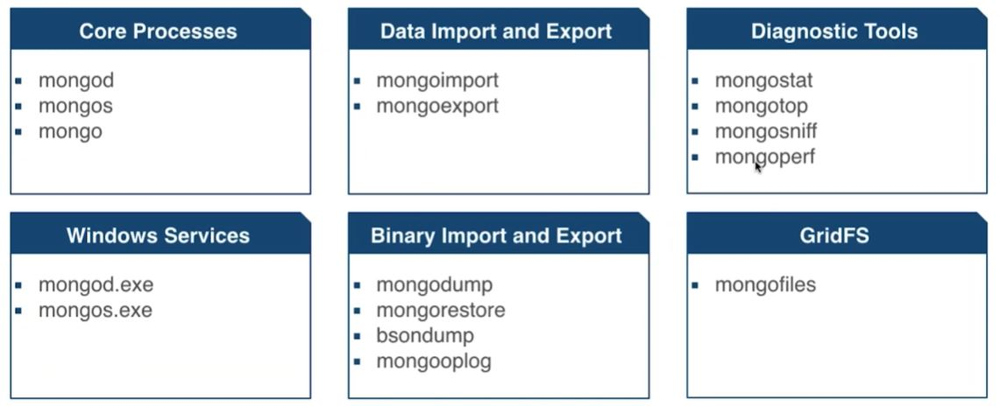

## JSON And BSON
* JSON\
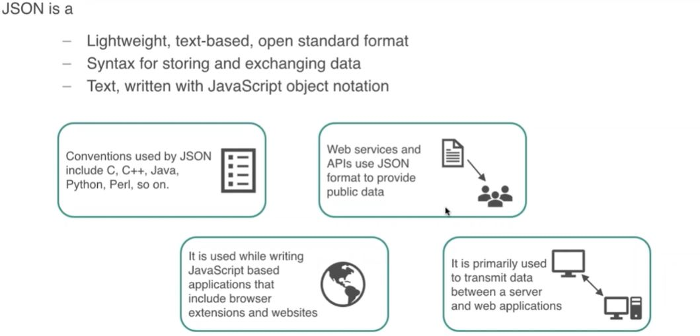
* BSON\
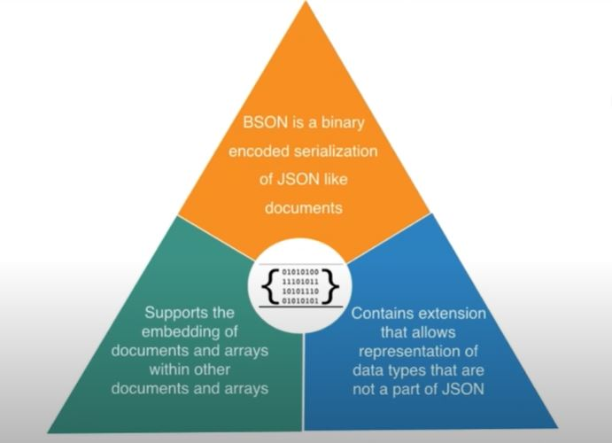
* BSON features
	* Lightweight
		* Optimising spatial overhead, specially when used over network
	* Traversable
		* For Primary data representation, BSON can be used, which traverses data easily
	* Efficient
		* Encoding/decoding data to/from BSON can be performed quickly
* JSON Vs BSON


# Mongo Commands
* Exit mongo client `mongo.exe`
```
exit
```
* Show DBs
```
show dbs;
show databases;
```
* Use specific database
```
use database-name;
```