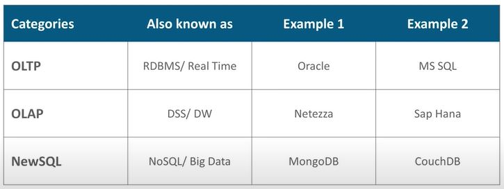
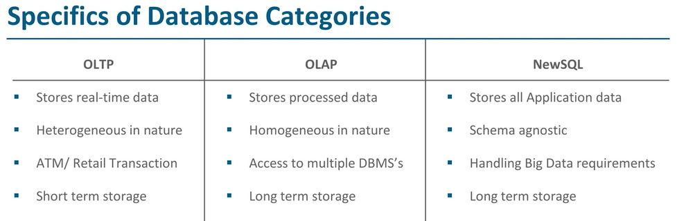

# Install MongoDB
* Download mongo db from - https://www.mongodb.com/try/download/community
	* Select appropriate `version`, `platform`, `package`
	* Prefer downloading `zip`
	* Click `Download` button
* Unzip if zip is downloaded
* Install if msi is downloaded
* Start mongo db database
```
location-to-mongo-db-bin>mongod.exe
```
* Start mongo console to execute queries
```
location-to-mongo-db-bin>mongo.exe
```

# Database categories
* High level view\

* Specifics\


# Basics
* Schema less
* Dynamic schema
* Most of NoSqls are open source
* Multiple types
	* Document
	* Key-Value
	* Tabular
	* Graph
* Examples
	* MongoDB
	* Cassandra
	* HBase
	* Neo4J
* Scaling
	* Horizontal scaling
	* Supports distributed by default